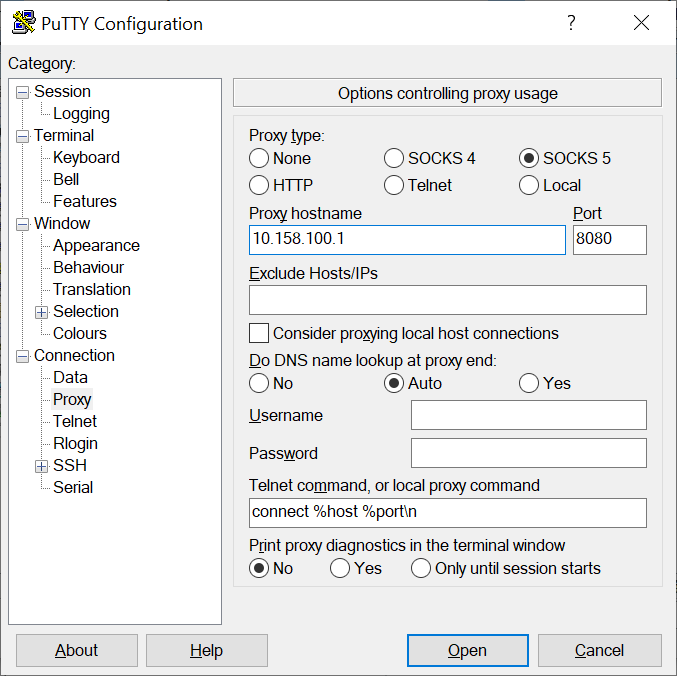

# Readme
This repository is used to play a bit around Azure. I demonstrates how to deploy VMs, Container Registry, Kubernetes Cluster, Containers, etc.
This is not a full training or learning material. It just give a feeling about Azure with some focus areas (especially containers).
The target is to have 2 hours of fun for the price of 1 or half bottle of beer (at Hungarian rate). Seriously, you will use my shared subscription so deploy carefully ;)

## Azure interface
In the below example we will use the [Azure Portal](https://portal.azure.com/) and the [Azure CLI](https://docs.microsoft.com/en-us/cli/azure/install-azure-cli?view=azure-cli-latest).

For Windows download the installer from here: [Azure CLI](https://aka.ms/installazurecliwindows)

While you install let's see how Azure organizes resources.

Open [Azure Portal](https://portal.azure.com/) and log in to your account.

## Azure hierarchy
It looks like this:


[Picture source](https://cloudacademy.com/blog/how-to-effectively-use-azure-management-groups-subscriptions-and-resource-groups/)

## Setup Azure CLI
After the installation, start a PowerShell and enter the following commands to configure the proxy.
This is temporary only to that PowerShell session.
Then login the Azure CLI. It will prompt up your default browser and ask you to log in.

```powershell
az login
```

## Create a Resource group
1. On the Azure portal's home screen select **Resource groups**. It opens the Resource groups "blade" where you might see other resource groups which belong to the same Subscription.
2. Click on **Add**
3. Give a **Name** to your own Resource group.
4. For the **Location** select "Central US". This location has some fancy features like Availability zones.
5. Then click on **Review + create**
6. Then once click on **Create**
It might take few seconds and your own Resource group is ready.

## Create your very first service
On the top of the portal there is a search bar.
1. Click on the **Search bar at the top**
2. And search for **Wordpress**
3. Select the "WordPress" from the Marketplace
4. Give a unique **Name** to your instance. This must be globally unique in the whole Azure.
5. At Resource Group select **Use existing** then select your previously created. At this point you can create a new resource group if it wouldn't exist.
6. Click on **App Service plan/Location**
   1. **Create new**
   2. Add a name to **App Service plan**
   3. Click on **Pricing tier**
   4. Go to the **Dev / Test** tab
   5. Select **F1**
   6. Click on **Apply**
   7. Click on **OK** at the bottom. Now the Service plan is updated with your named SP.
7. Click on Database
   1. Enter a random **Password**. We won't use it anywhere. To fulfill requirements use this: Password+1234
   2. And then **Confirm password**
   3. Select **Pricing tier**
   4. Go to **Basic** tab
   5. Bring the **vCore** and **Storage** slides to the minimum
   6. Click on **OK**
   7. And again click on **OK**
   8. Click on **Create**

The deployment is ongoing. You can track the deployment if you click on the bell icon on the top right on the portal.
It will take about 3 minutes.
When the deployment is done then:
1. Navigate to your own **Resource group**
2. Observe the new object which just deployed
3. Click on your item which has the **App Service** type
4. Observe the details
5. On the **Overview** page search for the **URL**. This is https://<your_given_name>.azurewebsites.net
6. Click on the link. Congratulation you have your very own website running on Azure.
7. Close your webpage tab and go back to Azure portal
8. Go back to your **Resource group**
9. Select your item which has the **Application Insights** type. Here you can see metrics and statistics about the application.
Are you happy? Then let's delete it :)

Clean up. You can notice that there are several resources automatically created inside your resource group. You can delete them  1 by 1. The easiest way to clean up everything is delete the whole resource group.
1. Navigate to your own **Resource group**
2. On the top menu click on **Delete resource group**
3. You need to re-enter its Name.
4. Click on **Delete**
Removing everything will take a while. No need to wait for it.

## Create a Container builder VM
We need a VM which will build our container and push it into the Registry.
1. On the home page click on **Create resource**. You can see **Categories** and some **Popular** options here. 
2. Click on **Ubuntu Server 18.04 LTS**. The VM creation blade comes up immediately.
3. At the **Resource group** click on the **Create new**. (If the previous is still under delete then give another name.)
4. Give a name at the **Virtual machine name**
5. For the **Region** select **Central US**
6. At the **Size**, click on the **Change size**
7. As we don't need a powerfull machine hence select **B1s**. (If you don't see it then remove the filters.)
8. For the **Authentication type** select **Password**
9. Give a **Username**
10. Give a **Password** and **Confirm password**. Hint: Password+1234
11. The SSH port shall be allowed for inbound.
12. There are additional options for networking and storage but we skip them.
13. Click on **Review + create**. The validation takes few seconds.
14. Click on **Create** and wait for the deployment.
The deployment takes ~5 minutes.

Meanwhile prepare putty with proxy.


## Build a container
When the VM deployment is done then it's time to build the first conatiner.
1. Go to your **Resource group**
2. Find your **Public IP address**. Hint: it has an own resource but your can find it a the Virtual Machine as well.
3. Connect to the VM via SSH. You shall use your given username/password.
4. Install Docker (SSH)
```bash
sudo apt-get update
sudo apt-get install docker docker.io
```
5. Build the first container (SSH)
```bash
sudo docker build -t boy:latest https://github.com/szasza576/azplayground.git#master:/nginx/boy
```
Hurray we have a container.

## Create a Container Registry
We need a Registry to store our containers. We could crete it on the portal but now we will use the Azure CLI.
1. Open your Powershell terminal what we prepared at the beginning.
2. To create the Registry we need the resource group's name and a name for the Registry itself. ACR name shall be globally unique. Run these in Powershell. For easier management we use environment variables so we can copy-paste the comnmands.
```powershell
$ResourceGroup="<yourresourcegroupname>"
$ACRName="<youracrname>"
az acr create --resource-group $ResourceGroup --name $ACRname --sku Basic
```
3. The deployment shall be done in few seconds.

## Create a Kubernetes Cluster
Note, this deployment takes the longest hence we start it as early.
We could run the container directly from the Registry without any K8s cluster but that wouldn't be fun enough. So let's create one.
1. Create a K8s cluster in Powershell
```powershell
$AKSName="<yourAKSname>"
az aks create --resource-group $ResourceGroup --name $AKSName --node-count 1 --enable-addons monitoring --generate-ssh-keys --kubernetes-version "1.15.5" --node-vm-size Standard_D2s_v3 --enable-cluster-autoscaler --min-count 1 --max-count 3 --attach-acr $ACRName --load-balancer-sku Basic
```
This will take a while (about 10 minutes).

Note, set up the access rights now to speed up replication!

## Grant access to the Builder VM to push to the Registry
We need to authenticate the Builder VM to the Registry hence we will create a **Managed Identity**.
You can find more details in [Azure's documentation](https://docs.microsoft.com/en-us/azure/container-registry/container-registry-authentication-managed-identity).
1. Create an Identity in powershell
```powershell
az identity create --resource-group $ResourceGroup --name myACRId
```
2. Get **user ID** and **service principal ID** of the new identity
```powershell
$userID=$(az identity show --resource-group $ResourceGroup --name myACRId --query id --output tsv)
$spID=$(az identity show --resource-group $ResourceGroup --name myACRId --query principalId --output tsv)
```
3. Assign Identity to our VM
```powershell
az vm identity assign --resource-group $ResourceGroup --name <<yourVMname>> --identities $userID
```
4. Grant identity access to the container registry
```powershell
$resourceID=$(az acr show --resource-group $ResourceGroup --name $ACRname --query id --output tsv)
az role assignment create --assignee $spID --scope $resourceID --role acrpush
```
5. The role is assigned. Check it on the portal.

## Push the container
The access is granted to the VM. Now we will connect to the Registry and push the image.
1. Go back to the SSH terminal of the VM
2. Install Azure-CLI on the VM (SSH)
```bash
curl -sL https://aka.ms/InstallAzureCLIDeb | sudo bash
```
3. Connect to Azure and then to the registry
```bash
az login --identity
sudo az acr login --name <youracrname>
```
4. Tag and push the image
```bash
sudo docker tag boy:latest gaborsacr.azurecr.io/boy:latest
sudo docker push gaborsacr.azurecr.io/boy:latest
```
5. On the portal search your **Container Registry**
6. In the left side menu click on the **Repositories**. And there you should see your new container.
7. We don't need the builder now so we can deallocate.
8. On the portal search your VM
9. Click on **Stop** and **Ok**

## Build our second container
Diversity is number 1 so build a container for the girls.
Instead of using a build VM we use the Registry's built in feature.
1. On github create an [access token](https://github.com/settings/tokens) and create an environment variable. Add **repo:status** and **public_repo** access.
```powershell
$PAT="<token>"
```
1. Create a task in powershell
```powershell
az acr task create --registry $ACRName --name buildgirls --image girl:latest --context https://github.com/szasza576/azplayground.git --file nginx/girl/Dockerfile --git-access-token $PAT
```
2. Run the task manually
```powershell
az acr task run --registry $ACRName --name buildgirls
```
3. You can see the build process
4. When the build is finished then go to the portal and check the Registry again
5. At the Registry check the **Tasks** submenu

## Deploy the containers on AKS
When the deployment is done then we can deploy our containers on AKS.

1. Install AKS CLI (kubectl)
```powershell
az aks install-cli
```
2. Get the credentials to the AKS.
```powershell
az aks get-credentials --resource-group $ResourceGroup --name $AKSName
```
3. Check if it works
```powershell
kubectl get nodes
```
4. Download the K8s Deployment and an index.html files from github to a local directory [boy](https://github.com/szasza576/azplayground/raw/master/k8s/boy.yml), [girl](https://github.com/szasza576/azplayground/raw/master/k8s/girl.yml), [neutral](https://github.com/szasza576/azplayground/raw/master/k8s/neutral.yml) and [neutral's index.html](https://github.com/szasza576/azplayground/raw/master/nginx/neutral/index.html)
5. Edit the files and change the image name to your registry URI.
6. Change the prompt to the download directory
7. Create the deployment for the boy
```powershell
kubectl create -f boy.yml
```
8. Check if the deployment is done
```powershell
kubectl get deployments
kubectl get pods
```

## Create a loadbalancer and expose the pods
We need an external IP address and then create a loadbalancer based on that. We use the portal for this task.

1. Navigate to your own **Resource group**
2. On the resource group's blade click to **Add**
3. Search for **Public IP address** and click on it
4. Add a **Name** and **DNS** if you wish. DNS is optional but shall be globally unique.
5. Select **Static**
6. Click on **Create**
7. Wait for the deployment (about 1 minute) and then navigate to the resource
8. Note the IP address
9. Download the [K8s Service file](https://github.com/szasza576/azplayground/raw/master/k8s/publicIP.yml)
10. Edit the file and update with your **Resource group** and your **Public IP**

Now comes a tricky part. The pods needs to register to the loadbalancer hence AKS needs management (Contributor) access to the Resource group. We take the K8s own Service Principal and assign Contributor right to the Resource group.
11. Grant Contributor rights to AKS (in PowerShell)
```powershell
$AKS_AppID=$(az aks show --resource-group $ResourceGroup --name $AKSName --query servicePrincipalProfile.clientId -o tsv)
$ResourceGroup_scope=$(az group show --resource-group $ResourceGroup --query id -o tsv)
az role assignment create --assignee $AKS_AppID --role "Contributor" --scope $ResourceGroup_scope
```
12. Check the AKS roles on the portal.
13. Refresh K8s credentials
```powershell
az aks get-credentials --resource-group $ResourceGroup --name $AKSName
```
14. Create the K8s Service
```powershell
kubectl create -f .\publicIP.yml
```
15. Wait until it gets the external IP address. Sometimes the Role assignment takes several minute and until AKS has no right to register the IP address for the loadbalancer. After 2-5 minutes the rights are synched and it works.
```powershell
kubectl get services
kubectl describe service kids
```
16. Open the IP address (or the DNS) in a browser

## Deploy the second Deployment
Now deploy the girl container and let's see what happens.
1. Create the deployment for the girl
```powershell
kubectl create -f girl.yml
```
2. Check if the deployment is done
```powershell
kubectl get deployments
kubectl get pods
```
3. Open the IP in another browser or incognito mode (cookies cause refresh issues).
You shall see boys and girls.

## Create a storage
The boys and girls are outdated as they have burnt in html page. The "neutral" is more advanced as it uses a volume.
1. Create a **Storage account** in powershell
```powershell
$StorageAccountName="<yourstorageaccountname>"
az storage account create --name $StorageAccountName --resource-group $ResourceGroup --sku Standard_LRS --kind StorageV2
```
2. We need the connection point of the new Storage account
```powershell
$StorageConnection=$(az storage account show-connection-string --name $StorageAccountName --resource-group $ResourceGroup -o tsv)
```
3. Create an **Azure File Share**. Note, the name shall match with the one in the K8s deployment file.
```powershell
$FileShareName="neutral-html"
az storage share create --name $FileShareName --connection-string $StorageConnection --quota 5
```
4. You can check the file share on the Portal as well
5. Navigate to **Storage accounts**
6. Select your new **Storage Account**
7. Select **File shares** at the left menu
8. Select your **File Share**. Called neutral-html
9. Click on **Upload**
10. Browse the previously downloaded index.html
11. Click on **Upload**

## Conncet K8s to the Storage account
Kubernetes needs an authentication token to the Storage.
1. Get the **Storage key**
$StorageKey=$(az storage account keys list --resource-group $ResourceGroup --account-name $StorageAccountName --query "[0].value" -o tsv)
2. Create a K8s secret
kubectl create secret generic azure-secret --from-literal=azurestorageaccountname=$StorageAccountName --from-literal=azurestorageaccountkey=$StorageKey

## Build and deploy the third container
We will use the same build mechanism how the girls are built.
1. Create a task in powershell
```powershell
az acr task create --registry $ACRName --name buildneutral --image neutral:latest --context https://github.com/szasza576/azplayground.git --file nginx/neutral/Dockerfile --git-access-token $PAT
```
2. Run the task manually
```powershell
az acr task run --registry $ACRName --name buildneutral
```
3. Create the deployment for the neutral
```powershell
kubectl create -f neutral.yml
```
4. Check if the deployment is done
```powershell
kubectl get deployments
kubectl get pods
```

## Scale the cluster automatically
Let's increase the Deplyoment size and then see how it scales the nodes.
1. Edit the deployment file and change replica count from 1 to 5.
```powershell
kubectl edit deployments boy
kubectl edit deployments girl
```
2. Edit the files, save and close them
3. Monitor the number of pods and the number of servers
```powershell
kubectl get deployments
kubectl get pods
kubectl get nodes
```
4. Also navigate to your AKS resource on the portal and check the **Nodes pools**
5. At the AKS resource, also check the **Insight** and **Metrics** submenus
Hurray it works :) Now delete it :P

## Template
Before we would delete the deployment we make a template from the concept.
1. Navigate to your own **Resource group**
2. Select all **Resources** by clicking on the checkbox
3. Click on **Export template** on the blade's top menu
4. Click on **Add to library**
5. Give a **Name** and a short **Description**
6. Click on **Save**
Now we can clean up the deployment.

## Clean up
Similar as we did at the beginning delete the whole resource group
1. Navigate to your own **Resource group**
2. On the top menu click on **Delete resource group**
3. You need to re-enter its Name.
4. Click on **Delete**
Removing everything will take a while. No need to wait for it.

## Redeploy from template
As we saved the template we can redeploy the concept with few clicks.
The only thing what the template didn't save is the managed identity. So we need to create another one.
1. Create a new **Resource group**. (If the previous is still under delete then use another name.)
2. Create a **Managed Identity** with the same name what you used earlier (it was myACRId in the example).
3. Search for **Templates** in the top search bar
4. Select your previously created template file
5. Click on **Deploy**
6. Select the right **Resource group**
7. You might change the default names. Hint, as the ACR needs unique name and the previous sandbox might be still under delete hence it is good idea to change that name.
8. Agree the terms at the bottom
9. Click on **Purchase**
You can see the deployment is on the way and new resources shall appear in the selected resource group.

## Final clean up
Don't forget to clean up your resource group to prevent extra charging.
Delete your resource group.
Hint, no need to wait the finish of the ongoing deployment. The resource group erase will terminate any ongoing creation.
